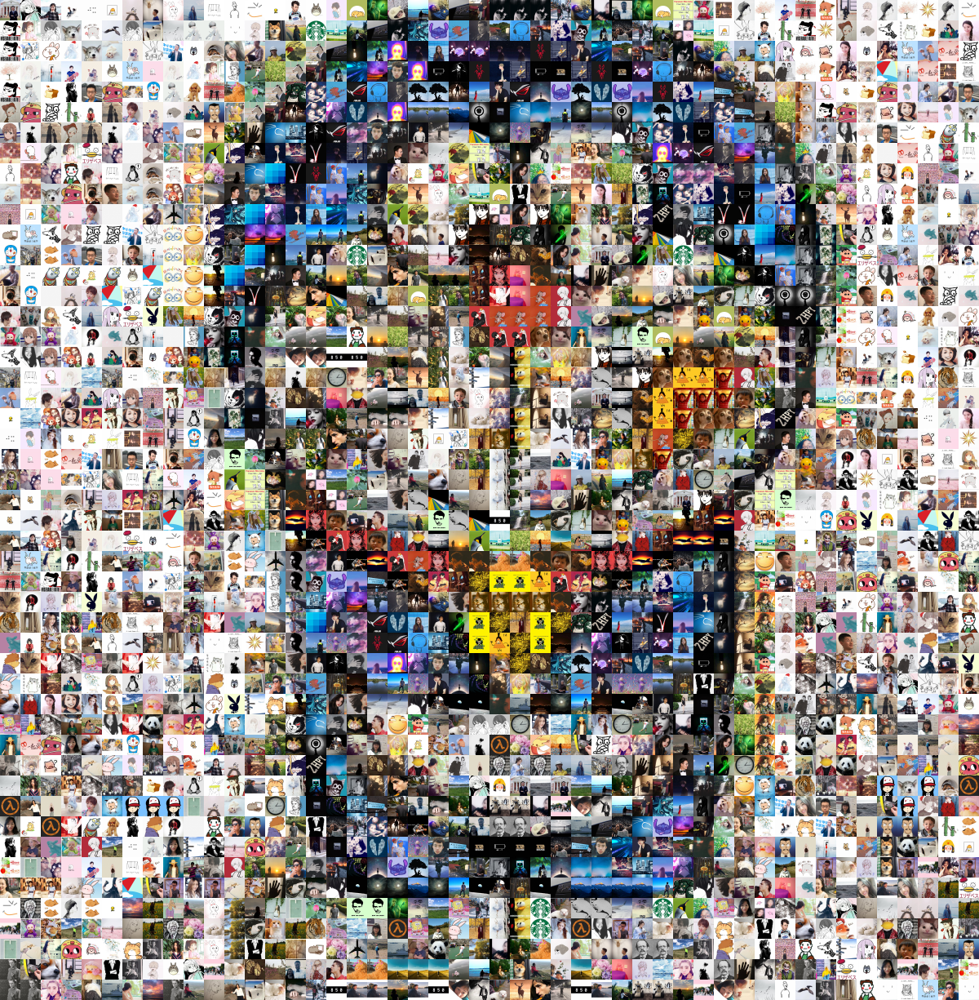
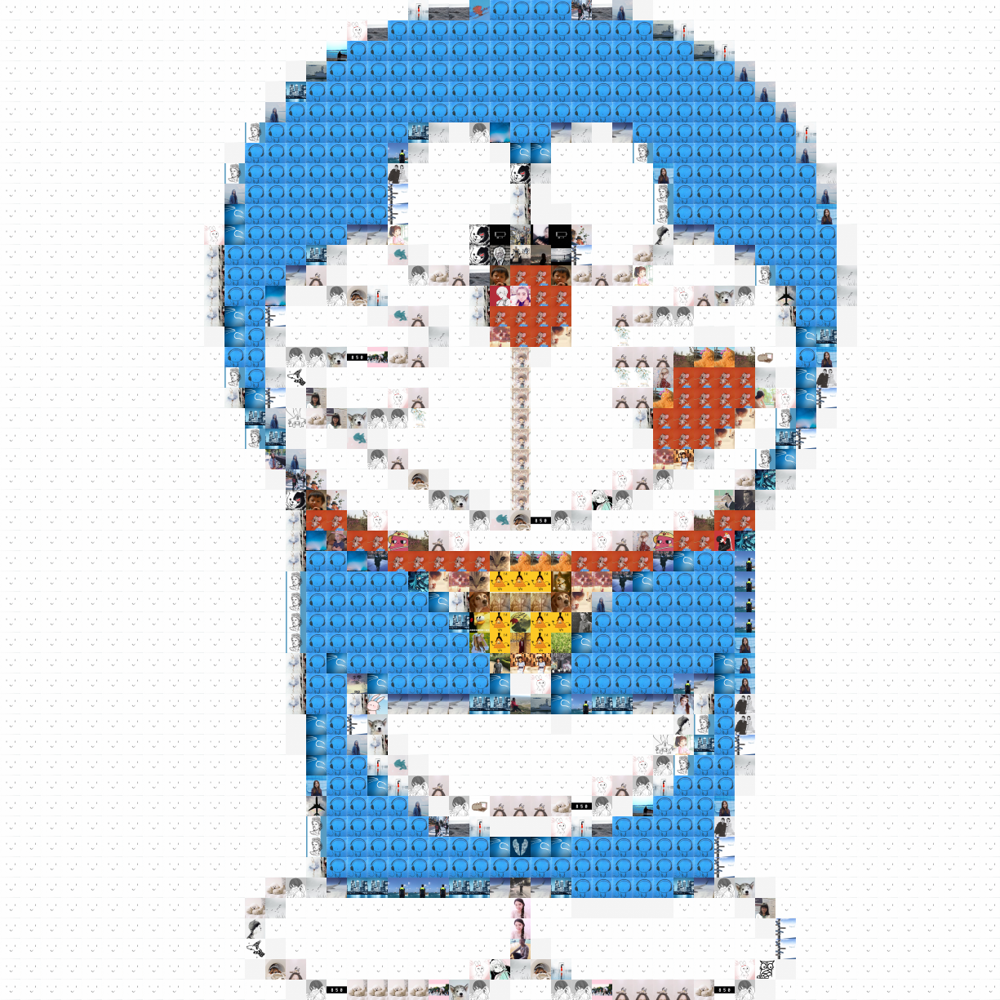

<table style="border: 0; text-align: center">
    <tr>
        <td>Tiles</td>
        <td>Photomosaic (Fair tile usage)</td>
    </tr>
    <tr>
        <td></td>
        <td></td>
    </tr>
    <tr>
        <td>Tiles Sorted by RGB sum</td>
        <td>Photomosaic (Best-fit)</td>
    </tr>
    <tr>
        <td></td>
        <td></td>
    </tr>
</table>

# Photomosaic Maker

> Version 3.0 Beta just released. It can create photomosaics with significantly better qualtity! Check it out. 


## Distinguishing Features of this Photomosaic Maker

A number of photomosaic makers already exist (like [mosaic](https://github.com/codebox/mosaic) and [Photomosaic-generator](https://github.com/uvipen/Photomosaic-generator)), but this photomosaic maker has the following unique features

- Can trade off between the fairness of the tiles and quality of the constructed photomosaic
  - Can ensure each tile is used exactly N times if desired (N is customizable)
- Supports saliency detection
- Has a graphical user interface

## Getting Started

You can either use our pre-built binaries from [release](https://github.com/hanzhi713/image-collage-maker/releases) or directly run our python script.

### Using the pre-built binary

Binaries can be downloaded from [release](https://github.com/hanzhi713/image-collage-maker/releases).

On Windows, my program may be blocked by Windows Defender because it is not signed (signing costs money!). Don't worry as there is no security risk. On MacOS or Linux, after downloading the binary, you may need to add executing permission. Open your terminal, go to the file's directory and type

```bash
chmod +x ./photomosaic-maker-3.0-macos-x64
```

Then you can run from terminal as

```bash
./photomosaic-maker-3.0-macos-x64
```

### Running Python script directly

First, you need Python >= 3.6 with pip. You can install dependencies by running

```bash
pip3 install -r requirements.txt
```

Then, you can launch the GUI by running

```bash
python3 gui.py
```

## Command line usage

> If you do not wish to use the GUI, a command line interface is also available. 

### Option 1: Sorting

```bash
python3 make_img.py --path img --sort bgr_sum --size 50
```

Use ```--ratio w h``` to change the aspect ratio, whose default is 16:9

Example: use ```--ratio 21 9``` to change the aspect ratio to 21:9

Result:


### Option 2: Make a photomosaic

To make a photomosaic, specify the path to the destination image using `--dest_img`

#### Option 2.1: Give a fair chance to each tile

This fitting option ensures that each tile is used for the same amount of times.

```bash
python3 make_img.py --path img --dest_img img/1.png --size 25 --dup 6 --out collage.png
```

```--dup 6``` specifies that each tile needs to be used 6 times (i.e. duplicates the set of tiles 6 times). Increase that number if you don't have enough source tiles or you want a better fitting result. Note that a large number of tiles may result in long computational time. To make sure the computation completes within a reasonable amount of time, it is recommended that you use less than 6000 tiles after duplication. Tile number larger than 6000 will probably takes longer than a minute to compute. Note that this recommended limit does **not** apply for the best fit option (see section below). 

| Original                                    | Fitting Result                                 |
| ------------------------------------------- | ---------------------------------------------- |
|  |  |


#### Option 2.2: Best fit (unfair tile usage)

This fitting option just selects the best subset of tiles you provided to approximate your destination tiles. Each tile in that subset will be used for an arbitrary number of times.

Add `--unfair` flag to enable this option. You can also specify `--max_width` to change the width of the grid. The height will be automatically calculated based on the max_width provided. Generally, a larger grid will give a better result. The default value is 80.

```bash
python3 make_img.py --path img --out best-fit.png --dest_img img/1.png --size 25 --unfair
```


| Original                                    | Fitting Result                                                   |
| :-------------------------------------------: | :--------------------------------------------------------------: |
|  |  |

Optionally, you can specify the `--freq_mul` parameter that trade-off between the fairness of the tiles and quality of the mosaic. The larger the `freq_mul`, more tiles will be used to construct the photomosaic, but the quality will deteriorate. The results under different `freq_mul` are shown below. Note that if you need a large `freq_mul`, you will better off by going for the fair tile usage (see section above) instead.

<!-- ```bash
python3 make_img.py --path img --out best-fit.png --dest_img img/1.png --size 25 --unfair --freq_mul 1.0
``` -->


#### Option 2.3 Display salient object only

This option makes photomosaic only for the salient part of the destination image. Rest of the area is filled with a background color. 

Add ```--salient``` flag to enable this option. You can still specify whether each tile is used for the same amount of times with the ```--unfair``` flag.

Use ```--lower_thresh``` to specify the threshold for object detection. The threshold ranges from 0.0 to 1.0; a higher threshold would lead to less object area. The default threshold is 0.5.

Use ```--background``` to specify the background color for the collage. The color space for the background option is RGB. The default background color is white, i.e. (255, 255, 255).

```bash
python make_img.py --recursive --path img/zhou --dest_img examples/messi.jpg --size 25 --salient --lower_thresh 0.15 --verbose --dup 5 --out examples/messi-fair.png
```

```bash
python make_img.py --recursive --path img/zhou --dest_img examples/messi.jpg --size 25 --salient --lower_thresh 0.15 --verbose --unfair --max_width 103 --freq_mul 0 --out examples/messi-unfair.png
```

| Original                                     | Unfair-Fitting Result                               | Fair-Fitting Result                               |
| -------------------------------------------- | --------------------------------------------------- | ------------------------------------------------- |
|  |  |  |

#### Other options

```python3 make_img.py -h``` will give you all the available command line options.

```
$ python make_img.py --help
usage: make_img.py [-h] [--path PATH] [--recursive]
                   [--num_process NUM_PROCESS] [--out OUT] [--size SIZE]
                   [--verbose] [--resize_opt {center,stretch}]
                   [--ratio RATIO RATIO]
                   [--sort {none,bgr_sum,av_hue,av_sat,av_lum,rand,pca_bgr,pca_hsv,pca_lab,pca_gray,pca_lum,pca_sat,pca_hue,tsne_bgr,tsne_hsv,tsne_lab,tsne_gray,tsne_lum,tsne_sat,tsne_hue}]
                   [--rev_row] [--rev_sort] [--dest_img DEST_IMG]
                   [--colorspace {hsv,hsl,bgr,lab,luv}]
                   [--metric {euclidean,cityblock,chebyshev}]
                   [--ctype {float32,float64}] [--unfair]
                   [--max_width MAX_WIDTH] [--freq_mul FREQ_MUL]
                   [--deterministic] [--dup DUP] [--salient]
                   [--lower_thresh LOWER_THRESH]
                   [--background BACKGROUND BACKGROUND BACKGROUND]
                   [--blending {alpha,brightness}]
                   [--blending_level BLENDING_LEVEL] [--exp]

optional arguments:
  -h, --help            show this help message and exit
  --path PATH           Path to the tiles (default: img)
  --recursive           Whether to read the sub-folders for the specified path
                        (default: False)
  --num_process NUM_PROCESS
                        Number of processes to use when loading tile (default:
                        8)
  --out OUT             The filename of the output collage/photomosaic
                        (default: )
  --size SIZE           Size (side length) of each tile in pixels in the
                        resulting collage/photomosaic (default: 50)
  --verbose             Print progress message to console (default: False)
  --resize_opt {center,stretch}
                        How to resize each tile so they become square images.
                        Center: crop a square in the center. Stretch: stretch
                        the tile (default: center)
  --ratio RATIO RATIO   Aspect ratio of the output image (default: (16, 9))
  --sort {none,bgr_sum,av_hue,av_sat,av_lum,rand,pca_bgr,pca_hsv,pca_lab,pca_gray,pca_lum,pca_sat,pca_hue,tsne_bgr,tsne_hsv,tsne_lab,tsne_gray,tsne_lum,tsne_sat,tsne_hue}
                        Sort method to use (default: bgr_sum)
  --rev_row             Whether to use the S-shaped alignment. (default:
                        False)
  --rev_sort            Sort in the reverse direction. (default: False)
  --dest_img DEST_IMG   The path to the destination image that you want to
                        build a photomosaic for (default: )
  --colorspace {hsv,hsl,bgr,lab,luv}
                        The colorspace used to calculate the metric (default:
                        lab)
  --metric {euclidean,cityblock,chebyshev}
                        Distance metric used when evaluating the distance
                        between two color vectors (default: euclidean)
  --ctype {float32,float64}
                        C type of the cost matrix. float32 is a good
                        compromise between computational time and accuracy.
                        Leave as default if unsure. (default: float32)
  --unfair              Whether to allow each tile to be used different amount
                        of times (unfair tile usage). (default: False)
  --max_width MAX_WIDTH
                        Maximum width of the collage. This option is only
                        valid if unfair option is enabled (default: 80)
  --freq_mul FREQ_MUL   Frequency multiplier to balance tile fairless and
                        mosaic quality. Minimum: 0. More weight will be put on
                        tile fairness when this number increases. (default: 1)
  --deterministic       Do not randomize the tiles. This option is only valid
                        if unfair option is enabled (default: False)
  --dup DUP             Duplicate the set of tiles by how many times (default:
                        1)
  --salient             Make photomosaic for salient objects only (default:
                        False)
  --lower_thresh LOWER_THRESH
                        The threshold for saliency detection, between 0.0 (no
                        object area = blank) and 1.0 (maximum object area =
                        original image) (default: 0.5)
  --background BACKGROUND BACKGROUND BACKGROUND
                        Background color in RGB for non salient part of the
                        image (default: (255, 255, 255))
  --blending {alpha,brightness}
                        The types of blending used. alpha: alpha
                        (transparency) blending. Brightness: blending of
                        brightness (lightness) channel in the HSL colorspace
                        (default: alpha)
  --blending_level BLENDING_LEVEL
                        Level of blending, between 0.0 (no blending) and 1.0
                        (maximum blending). Default is no blending (default:
                        0.0)
  --exp                 Do experiments (for testing only) (default: False)
```

### Downloading profile pictures of your WeChat friends

If you have a WeChat account, an utility script `extract_img.py` is provided to download your friends' profile pictures so you can make a photomosaic using them. To use this script, you need to have itchat-uos installed

```bash
pip3 install itchat-uos
```

Then, use `--dir` to specify the directory to store the profile pictures of your WeChat friends. 

```bash
python3 extract_img.py --dir img
```

#### Groupchat Members

You can also download the group members' profiles images from a group chat

```bash
python3 extract_img.py --dir img --type groupchat --name "groupchatname"
```

You can download members' profile pictures from all your groupchats if you omit the `--name` argument

```bash
python3 extract_img.py --dir img --type groupchat
```

#### All available profile pictures

You can download profile pictures from both your friends and members from all your groupchats by specifying `--type all`. 

```bash
python3 extract_img.py --dir img --type all
```

#### Notes

Due to unknown issues, sometimes some profile pictures are not available, so they will be blank and unusable. The photomosaic maker will automatically ignore them when loading images. 

## Credits (Names in alphabetical order)

Hanzhi Zhou ([hanzhi713](https://github.com/hanzhi713/)): Main algorithm and GUI implementation

Kaiying Shan ([kaiyingshan](https://github.com/kaiyingshan)): Saliency idea and implementation

Xinyue Lin: Idea for the "Best-fit"

Yufeng Chi ([T-K](https://github.com/T-K-233/)) : Initial Idea, crawler
