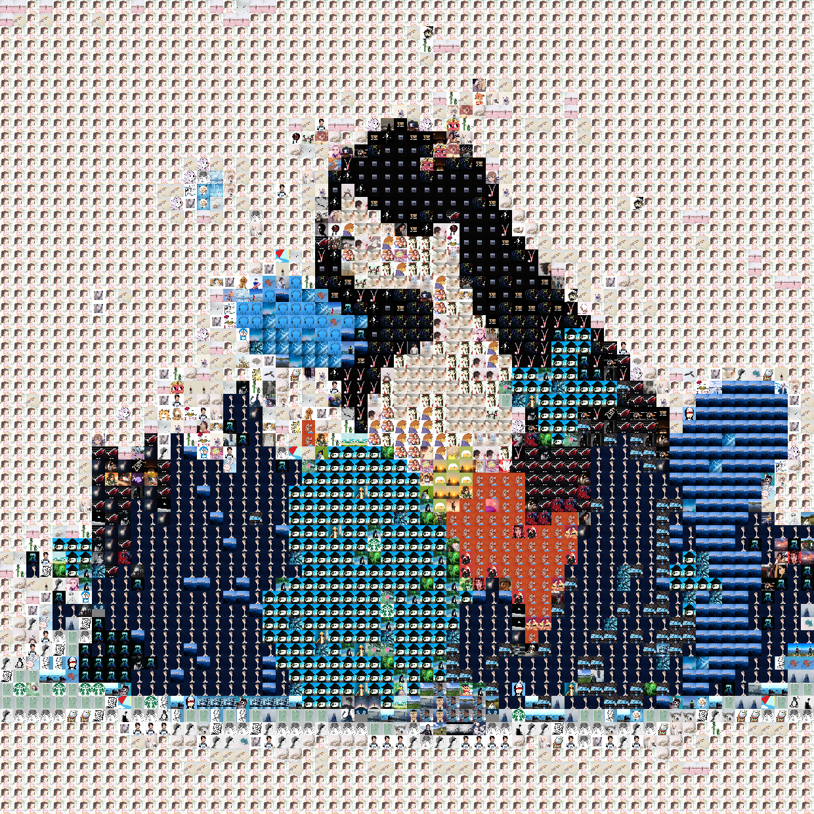

# Image Collage Maker


## System Requirements

- Python >= 3.5
- A WeChat account with a lot of friends

Note: The collage maker can be applied to any folder which contains a sufficient amount of images

### Install dependencies

Open the terminal and type

```bash
pip3 install itchat pillow opencv-python tqdm umap-learn scikit-learn matplotlib lap
```

## How to use

### 1\. Use [extract_img.py](extract_img.py) to download profile pictures of your WeChat friends

Download all your friends' profile pictures (--dir specifies the directory to store these images):

```bash
python3 extract_img.py --dir img
```

Or, download the group members' images in a group chat (replace ```name``` with the group chat's name and keep the double quotes):

```bash
python3 extract_img.py --dir img2 --type chatroom --name "name"
```

Sometimes the download may fail, especially when the program is running for the first time. In such case, you need to rerun program with an additional ```--clean``` flag

```bash
python3 extract_img.py --dir img --clean
```

### 2\. Use [make_img.py](make_img.py) to make the collage

You can run the GUI (experimental) to make the collage. Simply type

```bash
python3 gui.py
```

Or, read the following part for the usage of the command-line tool.

#### Option 1: Sorting

```bash
python3 make_img.py --path img --sort pca_lab --size 100
```

Use ```--ratio w h``` to change the aspect ratio, whose default is 16:9

Example: use ```--ratio 21 9``` to change aspect ratio to 21:9

Result:


#### Option 2: Fit a particular image

##### Option 2.1: Give a fair chance to each image

This fitting option ensures that each image is used the same amount of times.

```bash
python3 make_img.py --path img --collage img/1.png --size 25 --dup 10 --out collage.png
```

```--dup 10``` allows each source image to be used 10 times. Increase that number if you don't have enough source images or you want a better fitting result. Note that a large number of images may result in long computational time.

| Original                           | Fitting Result                        |
| ---------------------------------- | ------------------------------------- |
|  |  |


##### Option 2.2: Best fit

This fitting option just selects the best subset of images you provided to approximate your destination images. Each image in that subset will be used for arbitrary amount of times.

```bash
python3 make_img.py --path img --out collage-best-fit.png --collage img/1.png --size 25 --uneven
```

| Original                           | Fitting Result                                          |
| ---------------------------------- | ------------------------------------------------------- |
|  |  |


#### Other options

Use ```python3 make_img.py --help``` to get other optional arguments

## Mechanism

A brief description of the mechanism is available [here](Mechanism.md)

## Credits (Names in alphabetical order)

Hanzhi Zhou ([hanzhi713](https://github.com/hanzhi713/)) : Main algorithm and GUI implementation

Xinyue Lin : Idea for the "Uneven distribution (best-fit)"

Yufeng Chi ([T-K](https://github.com/T-K-233/)) : Initial Idea, crawler
