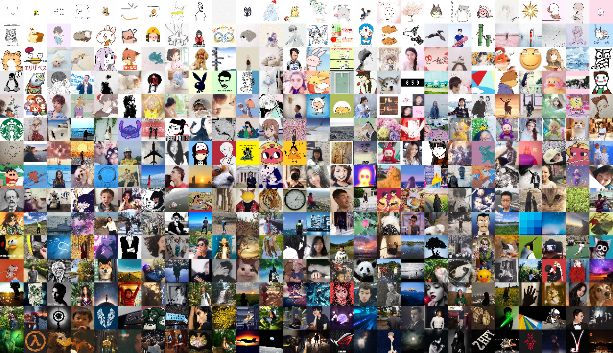
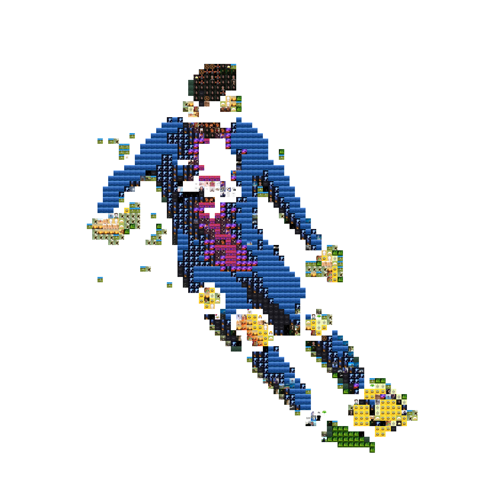
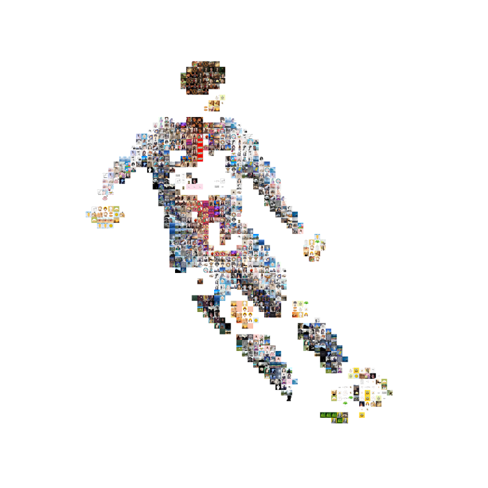

<table style="border: 0">
    <tr>
        <td></td>
        <td></td>
    </tr>
    <tr>
        <td></td>
        <td></td>
    </tr>
</table>

# Image Collage Maker

## System Requirements

- Python >= 3.5

### Install dependencies

```bash
pip3 install itchat pillow opencv-python opencv-contrib-python tqdm scikit-learn umap-learn matplotlib lapjv wurlitzer
```

>Note: You should not install "wurlitzer" if you're on Windows. It helps to visualize the progress of the linear sum assignment by redirecting output from the C++ code to python's stdout, but it does not work on Windows.

## How to use

>Note: If you already have a set of images to work with, you can skip step 1. The collage maker can be applied to any folder which contains a sufficient amount of images, not limited to your WeChat friends' profile pictures.

### 1\. Use [extract_img.py](extract_img.py) to download profile pictures of your WeChat friends

Download all your friends' profile pictures (--dir specifies the directory to store these images):

```bash
python3 extract_img.py --dir img
```

Or, download the group members' images in a group chat (replace ```name``` with the group chat's name and keep the double quotes):

```bash
python3 extract_img.py --dir img2 --type chatroom --name "name"
```

Sometimes the download may fail, especially when the program is running for the first time. In such case, you need to rerun program with an additional ```--clean``` flag

```bash
python3 extract_img.py --dir img --clean
```

### 2\. Use [make_img.py](make_img.py) to make a collage

You can run the GUI (experimental) to make the collage. Simply type

```bash
python3 gui.py
```

If you're using Windows or MacOS, you may want to try the [binaries](https://github.com/hanzhi713/image-collage-maker/releases) built by PyInstaller

Or, read the following part for the usage of the command-line tool.

#### Option 1: Sorting

```bash
python3 make_img.py --path img --sort pca_bgr --size 100
```

Use ```--ratio w h``` to change the aspect ratio, whose default is 16:9

Example: use ```--ratio 21 9``` to change the aspect ratio to 21:9

Result:


#### Option 2: Fit a particular image

##### Option 2.1: Give a fair chance to each image

This fitting option ensures that each image is used for the same amount of times.

```bash
python3 make_img.py --path img --collage img/1.png --size 25 --dup 10 --out collage.png
```

```--dup 10``` allows each source image to be used 10 times. Increase that number if you don't have enough source images or you want a better fitting result. Note that a large number of images may result in long computational time.

| Original                                    | Fitting Result                                 |
| ------------------------------------------- | ---------------------------------------------- |
|  |  |


##### Option 2.2: Best fit

This fitting option just selects the best subset of images you provided to approximate your destination images. Each image in that subset will be used for an arbitrary number of times.

Add ```--uneven``` flag to enable this option. You can also specify ```--max_width``` to change the width of the grid. The height will be automatically calculated based on the max_width provided. Generally, a larger grid will give a better result. The default value is 50.

```bash
python3 make_img.py --path img --out collage-best-fit.png --collage img/1.png --size 25 --uneven
```

| Original                                    | Fitting Result                                                   |
| ------------------------------------------- | ---------------------------------------------------------------- |
|  |  |

##### Option 2.3 Display salient object only

This fitting option only fits the source images with the pixels of the destination image that
constitute salient objects.

Add ```--salient``` flag to enable this option. You can still specify whether each image is used for the same amount of times with the ```--uneven``` flag.

Use ```--lower_thresh``` to specify the threshold for object detection. The threshold ranges from 0 to 225; a higher threshold would lead to less object area. The default threshold is 75. If you choose to use each image for the same amount of time, the threshold may have to change so that the number of source images and the number of pixels in the destination can converge. You may use ```--lower_thresh -1``` to enable adaptive thresholding (new in v.2.1).

Use ```--background``` to specify the background color for the collage. The color space for the background option is RGB. The default background color is white, i.e. (255, 255, 255).

```bash
python3 make_img.py --path img --out collage-best-fit.png --collage img/1.png --dup 16 --salient
```

```bash
python3 make_img.py --path img --out collage-best-fit.png --collage img/1.png --size 25 --salient --uneven
```

| Original                                     | Uneven-Fitting Result                               | Even-Fitting Result                               |
| -------------------------------------------- | --------------------------------------------------- | ------------------------------------------------- |
|  |  |  |

#### Other options

Use ```--sigma```to specify the multiplier of the identity matrix used as the covariance matrix of the bivariate normal distribution from which the weights of each pixel are sampled. A positive sigma implies a higher weight for the pixels in the middle of the image. A negative sigma indicates higher weight for the pixels close to the edge of the image. The greater the absolute value of the sigma, the greater the difference of weights between the pixels in the middle and the pixels on the edge will be.

Use ```--exp``` to traverse every possible sigmas and colorspace. If you use the option ```--salient```, use ```--exp``` to traverse thresholds from 40 to 190.

Use ```python3 make_img.py --help``` to get other optional arguments.

## Mechanism

A brief description of the mechanism is available [here](Mechanism.md)

## Credits (Names in alphabetical order)

Hanzhi Zhou ([hanzhi713](https://github.com/hanzhi713/)): Main algorithm and GUI implementation

Kaiying Shan ([kaiyingshan](https://github.com/kaiyingshan)): Saliency idea and implementation

Xinyue Lin: Idea for the "Uneven distribution (best-fit)"

Yufeng Chi ([T-K](https://github.com/T-K-233/)) : Initial Idea, crawler
