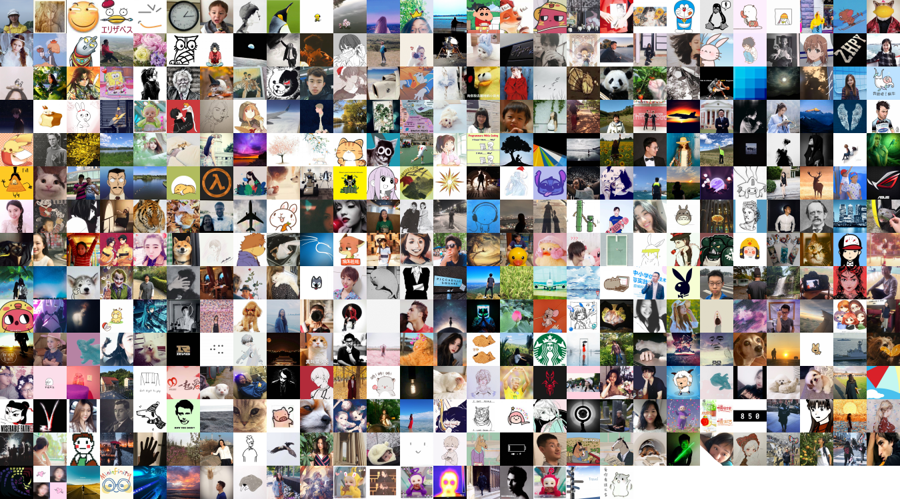
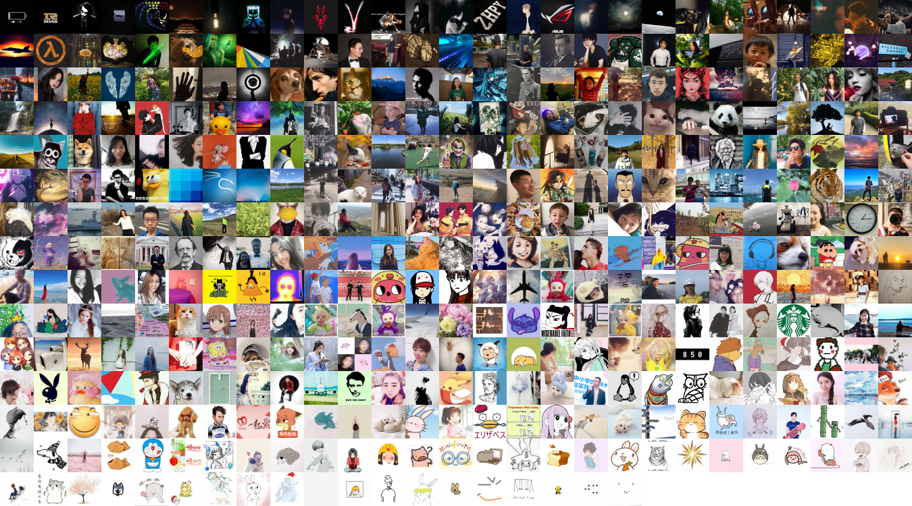
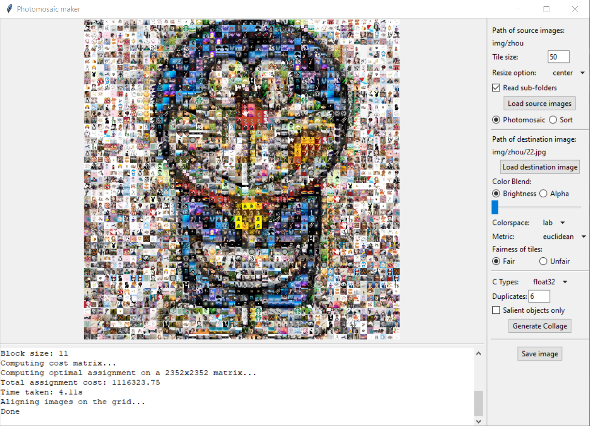
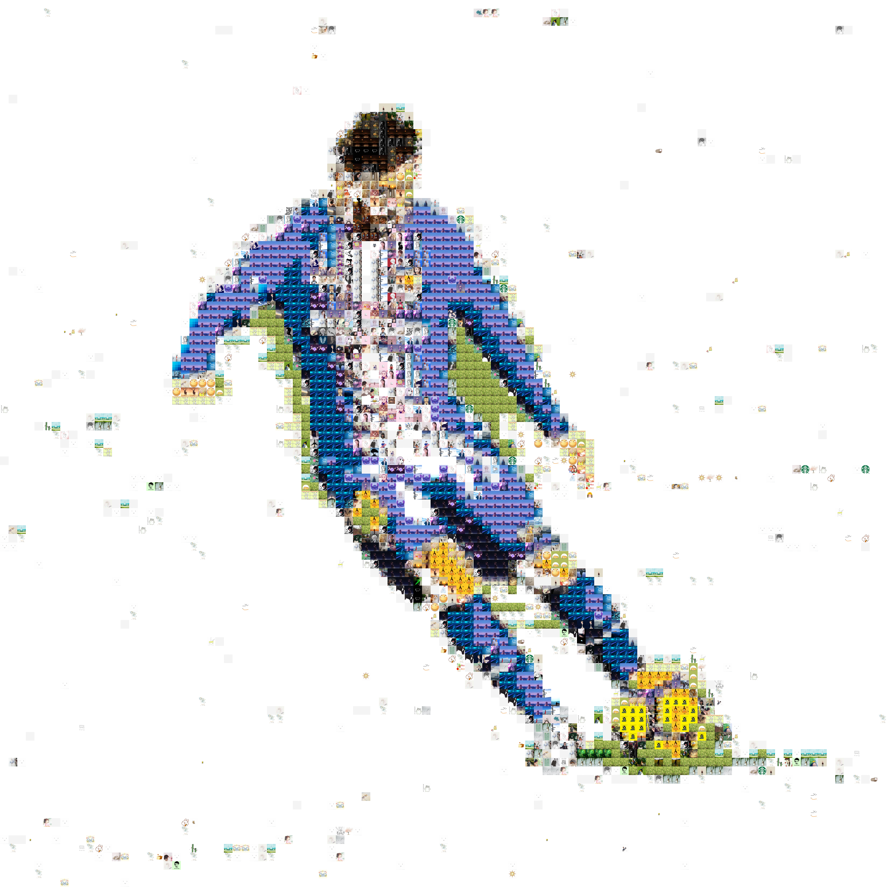
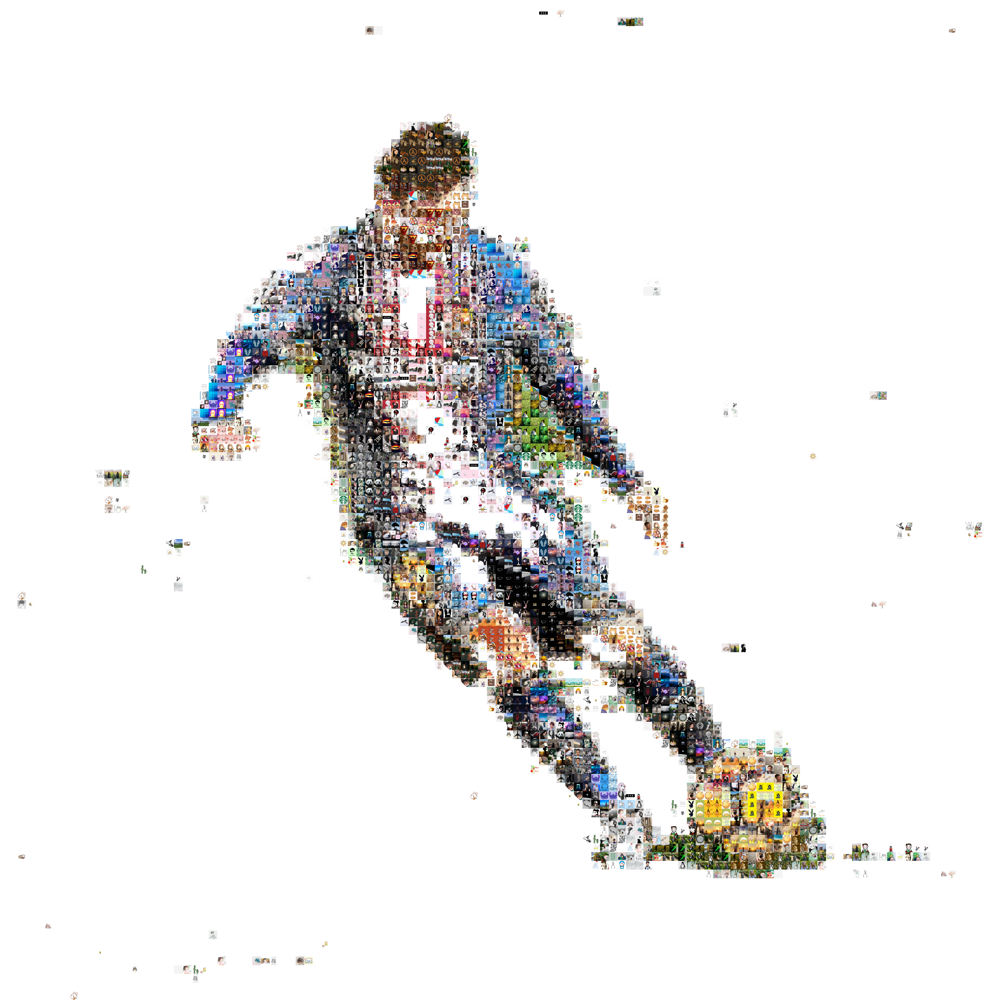
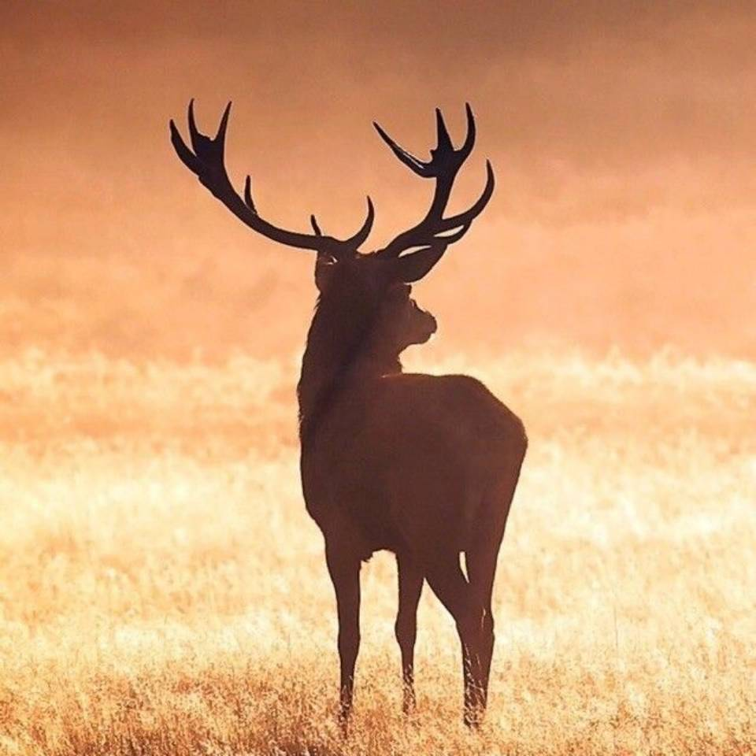
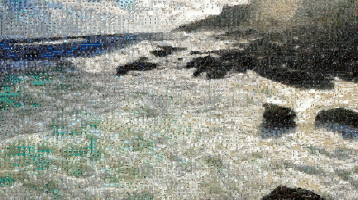

<table style="border: 0; text-align: center">
    <tr>
        <td>Tiles</td>
        <td>Photomosaic (Fair tile usage)</td>
    </tr>
    <tr>
        <td></td>
        <td></td>
    </tr>
    <tr>
        <td>Tiles Sorted by RGB sum</td>
        <td>Photomosaic (Best-fit)</td>
    </tr>
    <tr>
        <td></td>
        <td></td>
    </tr>
</table>

# Photomosaic Maker



- [Distinguishing Features of this Photomosaic Maker](#distinguishing-features-of-this-photomosaic-maker)
- [Getting Started](#getting-started)
  - [Using the pre-built binary](#using-the-pre-built-binary)
  - [Running Python script directly](#running-python-script-directly)
- [Command line usage](#command-line-usage)
  - [Option 1: Sorting](#option-1-sorting)
  - [Option 2: Make a photomosaic](#option-2-make-a-photomosaic)
    - [Option 2.1: Give a fair chance to each tile](#option-21-give-a-fair-chance-to-each-tile)
    - [Option 2.2: Best fit (unfair tile usage)](#option-22-best-fit-unfair-tile-usage)
    - [Option 2.3 Display salient object only](#option-23-display-salient-object-only)
    - [Blending Options](#blending-options)
    - [Dithering](#dithering)
  - [Option 3: Photomosaic Video](#option-3-photomosaic-video)
  - [Performance, multiprocessing and GPU acceleration](#performance-multiprocessing-and-gpu-acceleration)
    - [Time and space complexity](#time-and-space-complexity)
    - [Multiprocessing](#multiprocessing)
    - [GPU acceleration](#gpu-acceleration)
  - [All command line options](#all-command-line-options)
- [Utility Script: download profile pictures of your WeChat friends](#utility-script-download-profile-pictures-of-your-wechat-friends)
  - [Groupchat Members](#groupchat-members)
  - [All available profile pictures](#all-available-profile-pictures)
  - [Notes](#notes)
- [Credits (Names in alphabetical order)](#credits-names-in-alphabetical-order)


## Distinguishing Features of this Photomosaic Maker

A number of photomosaic makers already exist (like [mosaic](https://github.com/codebox/mosaic) and [Photomosaic-generator](https://github.com/uvipen/Photomosaic-generator)), but this photomosaic maker has the following unique features

- Can trade off between the fairness of the tiles and quality of the constructed photomosaic
  - Can ensure each tile is used exactly N times if desired (N is customizable)
- Supports non square tile size
- Supports photomosaic videos
- Optional GPU acceleration
- Supports saliency detection
- Has a graphical user interface

## Getting Started

You can either use our pre-built binaries from [release](https://github.com/hanzhi713/image-collage-maker/releases) or directly run our python script.

### Using the pre-built binary

**If you need GPU acceleration or need to make [photomosaic videos](#option-3-photomosaic-video), please refer to the [Command line usage](#command-line-usage)**

Binaries can be downloaded from [release](https://github.com/hanzhi713/image-collage-maker/releases). If it is desired, please run the python scripts directly (see section below).

On Windows and MacOS, my program may be blocked because it is not signed (signing costs money!). Don't worry as there is no security risk. On MacOS or Linux, after downloading the binary, you may need to add executing permission. Open your terminal, go to the file's directory and type

```bash
chmod +x ./photomosaic-maker-4.0-macos-x64
```

Then you can run from terminal as

```bash
./photomosaic-maker-4.0-macos-x64
```

### Running Python script directly

First, you need Python >= 3.7 with pip. You can install dependencies by running

```bash
pip install -r requirements.txt
```

If you want GPU acceleration, you need to install cupy. Consult the [cupy documentation](https://docs.cupy.dev/en/stable/install.html).

Then, you can either use GUI by running

```bash
python gui.py
```

or you can refer to the command line usage below.  

## Command line usage

> If you do not wish to use the GUI, a command line interface is also available. Make sure that you've installed dependencies in the section above. 

### Option 1: Sorting

```bash
python make_img.py --path img/zhou --sort bgr_sum --size 50 --out examples/sort-bgr.png
```

`--size` takes one or two arguments. If only one is specified, it is interpreted as the tile width and tile height will be inferred from the aspect ratios of the tiles provided (this corresponds to the `infer height` option in the GUI). If two are specified, they are interpreted as width and height. 

Use `--ratio w h` to change the aspect ratio, whose default is 16:9. E.g. `--ratio 21 9` specifies the aspect ratio to be 21:9. 

> Note: when the tiles are a bit short to completely fill the grid, white tiles will be added. 

Result:


### Option 2: Make a photomosaic

To make a photomosaic, specify the path to the destination image using `--dest_img`

#### Option 2.1: Give a fair chance to each tile

This fitting option ensures that each tile is used for the same amount of times, but is the most computationally and memory intensive option. 

> a few tiles might be used one more time than others. This may happen when the number of tiles is not an integer multiple of the blocks of the destination image. 

```bash
python make_img.py --path img/zhou --dest_img examples/dest.jpg --size 25 --dup 6 --out examples/fair-dup-10.png
```

`--dup 6` specifies that each tile needs to be used 6 times (i.e. duplicates the set of tiles 6 times). Increase that number if you don't have enough source tiles or you want a better fitting result. This can be a non integer too. For example, `--dup 0.5` means only 50% of the tiles will be used, and `--dup 2.5` means all tiles on average will be used 2.5 times (half of the tiles will be used 2 times and the other half will be used 3 times). 

To make sure the computation completes within a reasonable amount of time, it is recommended that you use less than 6000 tiles after duplication. Tile number larger than 6000 will probably takes longer than a minute to compute. Note that this recommended limit does **not** apply for the best fit option (see section below). 

| Original                                    | Fitting Result                                     |
| ------------------------------------------- | -------------------------------------------------- |
|  |  |

#### Option 2.2: Best fit (unfair tile usage)

This fitting option just selects the best subset of tiles you provided to approximate your destination tiles. Each tile in that subset will be used for an arbitrary number of times.

Add `--unfair` flag to enable this option. You can also specify `--max_width` to change the width of the grid. The height will be automatically calculated based on the max_width provided. Generally, a larger grid will give a better result. The default value is 80.

```bash
python make_img.py --path img/zhou --dest_img examples/dest.jpg --size 25 --unfair --max_width 56 --out examples/best-fit.png
```

|                  Original                   |                 Fitting Result                  |
| :-----------------------------------------: | :---------------------------------------------: |
|  |  |

Optionally, you can specify the `--freq_mul` (frequency multiplier) parameter that trade offs between the fairness of the tiles and quality of the mosaic. 

```bash
python3 make_img.py --path img --out best-fit.png --dest_img img/1.png --size 25 --unfair --freq_mul 1.0
```

The larger the `freq_mul`, more tiles will be used to construct the photomosaic, but the quality will deteriorate. The results under different `freq_mul` are shown below. Note that if you need a large `freq_mul`, you will better off by going for the fair tile usage (see section above) instead.


#### Option 2.3 Display salient object only

This option makes photomosaic only for the salient part of the destination image. Rest of the area is filled with a background color. 

Add ```--salient``` flag to enable this option. You can still specify whether each tile is used for the same amount of times with the ```--unfair``` flag.

Use ```--lower_thresh``` to specify the threshold for object detection. The threshold ranges from 0.0 to 1.0; a higher threshold would lead to less object area. The default threshold is 0.5.

Use ```--background``` to specify the background color for the collage. The color space for the background option is RGB. The default background color is white, i.e. (255, 255, 255).

```bash
python make_img.py --path img/zhou --dest_img examples/messi.jpg --size 25 --salient --lower_thresh 0.15 --dup 5 --out examples/messi-fair.png
```

```bash
python make_img.py --path img/zhou --dest_img examples/messi.jpg --size 25 --salient --lower_thresh 0.15 --unfair --max_width 115 --out examples/messi-unfair.png
```

| Original                                     | Unfair-Fitting Result                               | Fair-Fitting Result                               |
| -------------------------------------------- | --------------------------------------------------- | ------------------------------------------------- |
|  |  |  |

#### Blending Options

To enhance the effect of the photomosaic, you can enable alpha or brightness blending. Use the `--blending` option to select the types of blending and `--blending_level` to change the level of blending. 

```bash
# alpha blending
python make_img.py --path img/zhou --dest_img examples/dest.jpg --size 25 --dup 8 --blending alpha --blending_level 0.25 --out examples/blend-alpha-0.25.png

# brightness blending
python make_img.py --path img/zhou --dest_img examples/dest.jpg --size 25 --dup 8 --blending brightness --blending_level 0.25 --out examples/blend-brightness-0.25.png
```

| Fair tile usage, no blending                       | Alpha blending (25%)                                    | Brightness blending (25%)                                    |
| -------------------------------------------------- | ------------------------------------------------------- | ------------------------------------------------------------ |
|  |  |  |

#### Dithering

> See https://en.wikipedia.org/wiki/Dither for a detailed explanation of dithering

Dithering can be used to reduce color banding when there exists a color gradient. To enable dithering, add `--dither` flag. My implementation uses [Floyd–Steinberg dithering](https://en.wikipedia.org/wiki/Floyd%E2%80%93Steinberg_dithering). 

```bash
python make_img.py --path img/zhou --dest_img examples/dest2.jpg --size 10 --unfair --max_width 200 --freq_mul 0.0 --dither --out examples/dither.png
```

| Original image                               | Best fit, no dither                              | Best fit, dither                              |
| -------------------------------------------- | ------------------------------------------------ | --------------------------------------------- |
|  |  |  |

While dithering works the best when `freq_mul` is set to zero, it can still work and provide some visual differences when `freq_mul > 0`. 

```bash
# dither when freq_mul is 0.1
python make_img.py --path img/zhou --dest_img examples/dest2.jpg --size 10 --unfair --max_width 200 --freq_mul 0.1 --dither --deterministic --out examples/f-dither.png
```

| Original image                               | `freq_mul = 0.1`, no dither                              | `freq_mul = 0.1`, dither                              |
| -------------------------------------------- | ------------------------------------------------ | --------------------------------------------- |
|  |  |  |

Note that dithering is **not supported** in fair mode, when randomization is enabled or when saliency is enabled. Also, dithering is not recommended to use with `--gpu`, or you may experience slow computation compared to CPU processing. 

### Option 3: Photomosaic Video



It is possible to make a photomosaic video simply by repeating the methods listed in Option 2 to every certain frame (specified by `--skip_frame`) of the video. You can pass the path of the video with `--dest_img` and add the `--video` flag to tell the program it is a video. This is much faster than processing the video manually frame by frame (e.g. pass different `dest_img` each time), because a lot of information is cached and can be reused between frames. Example:

```bash
python make_img.py --path img/catsdogs --dest_img img/2out.mp4 --size 20 --unfair --max_width 100 --freq_mul 2 --out v_freq_2.mp4 --gpu --video --skip_frame 2
```

Do note that some options are not supported, and some options are slower than other. Generally, saliency is not recommended to use on videos due to its long computational time and difficulty to tune. Each frame might need its own threshold. 

| Saliency/Fairness | Fair        | Unfair |
| ----------------- | ----------- | ------ |
| saliency enabled  | Unsupported | Slow   |
| saliency disabled | Very slow   | Fast   |

### Performance, multiprocessing and GPU acceleration

#### Time and space complexity

Different photomosaic making options have different computational complexity. The following table shows the time and space complexity of different cases. Here, `n` is the number of tiles (after duplication in fair mode), `m` is the number of pixels in the destination image, and `k` is the number of tiles used in the unfair mode (this is equal to your specified `max_width` multiplied by the aspect ratio of your destination image).  

| Type of photomosaic  | Time complexity    | Space complexity | GPU acceleration                               |
| -------------------- | ------------------ | ---------------- | ---------------------------------------------- |
| Fair                 | `O(nm + n^3)`      | `O(nm)`          | partial (~10x speed up for the `nm` part only) |
| Unfair, freq_mul > 0 | `O(nm + nk log n)` | `O(m + n)`       | full (~5-10x speed up)                         |
| Unfair, freq_mul = 0 | `O(nm + nk)`       | `O(m + n)`       | full (~5-10x speed up)                         |

Takeaway 1:

The high (cubic) computational complexity of the fair mode means that the computation time grows much faster with respect to the number of tiles. It typically takes 30 seconds for 5000 tiles and 5 minutes for 10000 tiles. For large tile count, unless you need strict fair tile usage, you should go for the unfair mode and set freq_mul appropriately. 

Takeaway 2:

Notice the role of `m` in the complexity. If you have a high-definition destination image (e.g. 8000x6000) and notice the computation time is long, you can first downsample it so the number of pixels (`m`) will be lower. Do note that over downsampling will reduce the quality of the photomosaic. 

#### Multiprocessing

The `--num_process` option specifies the number of processes (cpu cores) to use. This defaults to half of you available logical CPUs. However, this only applies to the reading tiles phase and photomosaic video processing. For photomosaic video, if you have a small number of tiles or a large number of available CPU cores, using multiprocessing may be faster than enabling GPU acceleration. 

#### GPU acceleration

For command line, GPU acceleration can be enabled with the `--gpu` flag. For GUI (`gui.py`), it will be automatically enabled if you have `cupy` installed. However, note it can only provide the listed speedup if `nm` **is large**, typically **>= 10^10**. Another way to judge whether GPU acceleration could be useful is observe the `Distance matrix size` message from the log. Typically, `Distance matrix size` **>= 100MB** work great on GPU. 

### All command line options

```python make_img.py -h``` will give you all the available command line options.

```
$ python make_img.py -h
usage: make_img.py [-h] [--path PATH] [--recursive] [--num_process NUM_PROCESS] [--out OUT] [--size SIZE [SIZE ...]] 
                   [--quiet] [--auto_rotate {-1,0,1}] [--resize_opt {center,stretch}] [--gpu] [--mem_limit MEM_LIMIT]
                   [--tile_info_out TILE_INFO_OUT] [--ratio RATIO RATIO] [--sort {none,bgr_sum,av_hue,av_sat,av_lum,rand}]    
                   [--rev_row] [--rev_sort] [--dest_img DEST_IMG] [--colorspace {hsv,hsl,bgr,lab,luv}]
                   [--metric {euclidean,cityblock,chebyshev,cosine}] [--unfair] [--max_width MAX_WIDTH]
                   [--freq_mul FREQ_MUL] [--dither] [--deterministic] [--dup DUP] [--salient] [--lower_thresh LOWER_THRESH]   
                   [--background BACKGROUND BACKGROUND BACKGROUND] [--blending {alpha,brightness}]
                   [--blending_level BLENDING_LEVEL] [--video] [--skip_frame SKIP_FRAME] [--exp]

optional arguments:
  -h, --help            show this help message and exit
  --path PATH           Path to the tiles (default: C:\Users\kaiying\Desktop\Code\image-collage-maker\img)
  --recursive           Whether to read the sub-folders for the specified path (default: False)
  --num_process NUM_PROCESS
                        Number of processes to use for parallelizable operations (default: 8)
  --out OUT             The filename of the output collage/photomosaic (default: result.png)
  --size SIZE [SIZE ...]
                        Width and height of each tile in pixels in the resulting collage/photomosaic. If two numbers are      
                        specified, they are treated as width and height. If one number is specified, the number is treated    
                        as the widthand the height is inferred from the aspect ratios of the images provided. (default:       
                        (50,))
  --quiet               Do not print progress message to console (default: False)
  --auto_rotate {-1,0,1}
                        Options to auto rotate tiles to best match the specified tile size. 0: do not auto rotate. 1:
                        attempt to rotate counterclockwise by 90 degrees. -1: attempt to rotate clockwise by 90 degrees       
                        (default: 0)
  --resize_opt {center,stretch}
                        How to resize each tile so they become square images. Center: crop a square in the center. Stretch:   
                        stretch the tile (default: center)
  --gpu                 Use GPU acceleration. Requires cupy to be installed and a capable GPU. Note that USUALLY this is      
                        useful when you: 1. only have few cpu cores, and 2. have a lot of tiles (typically > 10000) 3. and    
                        are using the unfair mode. Also note: enabling GPU acceleration will disable multiprocessing on CPU   
                        for videos (default: False)
  --mem_limit MEM_LIMIT
                        The APPROXIMATE memory limit in MB when computing a photomosaic in unfair mode. Applicable both CPU   
                        and GPU computing. If you run into memory issues when using GPU, try reduce this memory limit
                        (default: 4096)
  --tile_info_out TILE_INFO_OUT
                        Path to save the list of tile filenames for the collage/photomosaic. If empty, it will not be saved.  
                        (default: )
  --ratio RATIO RATIO   Aspect ratio of the output image (default: (16, 9))
  --sort {none,bgr_sum,av_hue,av_sat,av_lum,rand}
                        Sort method to use (default: bgr_sum)
  --rev_row             Whether to use the S-shaped alignment. (default: False)
  --rev_sort            Sort in the reverse direction. (default: False)
  --dest_img DEST_IMG   The path to the destination image that you want to build a photomosaic for (default: )
  --colorspace {hsv,hsl,bgr,lab,luv}
                        The colorspace used to calculate the metric (default: lab)
  --metric {euclidean,cityblock,chebyshev,cosine}
                        Distance metric used when evaluating the distance between two color vectors (default: euclidean)      
  --unfair              Whether to allow each tile to be used different amount of times (unfair tile usage). (default:        
                        False)
  --max_width MAX_WIDTH
                        Maximum width of the collage. This option is only valid if unfair option is enabled (default: 80)     
  --freq_mul FREQ_MUL   Frequency multiplier to balance tile fairless and mosaic quality. Minimum: 0. More weight will be     
                        put on tile fairness when this number increases. (default: 0.0)
  --dither              Whether to enabled dithering. You must also specify --deterministic if enabled. (default: False)      
  --deterministic       Do not randomize the tiles. This option is only valid if unfair option is enabled (default: False)    
  --dup DUP             If a positive integer: duplicate the set of tiles by how many times. Can be a fraction (default: 1)   
  --salient             Make photomosaic for salient objects only (default: False)
  --lower_thresh LOWER_THRESH
                        The threshold for saliency detection, between 0.0 (no object area = blank) and 1.0 (maximum object    
                        area = original image) (default: 0.5)
  --background BACKGROUND BACKGROUND BACKGROUND
                        Background color in RGB for non salient part of the image (default: (255, 255, 255))
  --blending {alpha,brightness}
                        The types of blending used. alpha: alpha (transparency) blending. Brightness: blending of brightness  
                        (lightness) channel in the HSL colorspace (default: alpha)
  --blending_level BLENDING_LEVEL
                        Level of blending, between 0.0 (no blending) and 1.0 (maximum blending). Default is no blending       
                        (default: 0.0)
  --video               Make a photomosaic video from dest_img which is assumed to be a video (default: False)
  --skip_frame SKIP_FRAME
                        Make a photomosaic every this number of frames (default: 1)
  --exp                 Do experiments (for testing only) (default: False)
```

## Utility Script: download profile pictures of your WeChat friends

If you have a WeChat account, an utility script `extract_img.py` is provided to download your friends' profile pictures so you can make a photomosaic using them. To use this script, you need to have itchat-uos installed

```bash
pip install itchat-uos
```

Then, use `--dir` to specify the directory to store the profile pictures of your WeChat friends. 

```bash
python extract_img.py --dir img
```

### Groupchat Members

You can also download the group members' profiles images from a group chat

```bash
python extract_img.py --dir img --type groupchat --name "groupchatname"
```

You can download members' profile pictures from all your groupchats if you omit the `--name` argument

```bash
python extract_img.py --dir img --type groupchat
```

### All available profile pictures

You can download profile pictures from both your friends and members from all your groupchats by specifying `--type all`. 

```bash
python extract_img.py --dir img --type all
```

### Notes

1. Due to unknown issues, sometimes some profile pictures are not available, so they will be blank and unusable. The photomosaic maker will automatically ignore them when loading images. 
2. When you download a large amount of profile pictures at once, WeChat may block you from downloading more. This will appear as `timeout downloading pics, retrying.... attempt x` in terminal. When this happens, you can terminate the program and run it again a day after. Already downloaded profile pictures will not be downloaded again. 

## Credits (Names in alphabetical order)

Hanzhi Zhou ([hanzhi713](https://github.com/hanzhi713/)): Main algorithm and GUI implementation

Kaiying Shan ([kaiyingshan](https://github.com/kaiyingshan)): Saliency idea and implementation

Xinyue Lin: Idea for the "Best-fit"

Yufeng Chi ([T-K](https://github.com/T-K-233/)) : Initial Idea, crawler
